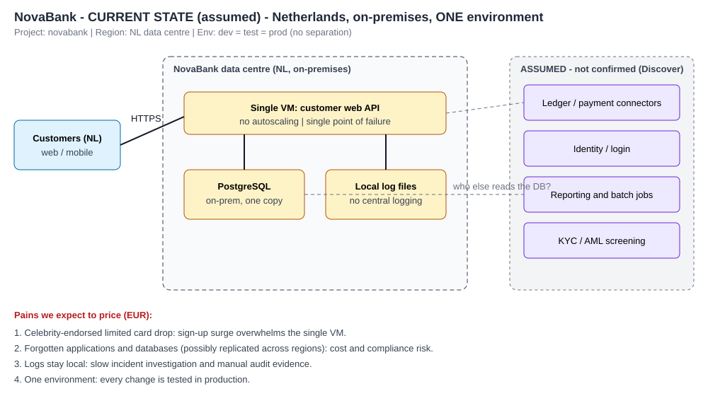
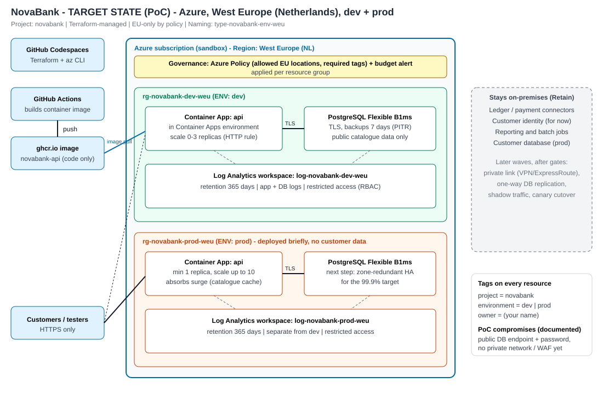

# NovaBank cloud foundation - summary (max 3 pages)

## Business context (assumed, see assumptions.md)
NovaBank is a small Dutch digital issuer of prepaid gift cards. Today one VM runs the customer API, PostgreSQL
is on-prem, logs are local, and there is one environment. Expected costly problems: (1) limited-edition card
drops cause surges that overwhelm the VM, (2) forgotten apps/databases create cost and compliance risk,
(3) local logs slow incidents and audits, (4) every change is tested in production.

## Thesis
Get the foundation right, prove it works, then add AI where it pays.

## What I built (3-hour scope)

Azure, West Europe, Terraform. Dev and prod in separate resource groups. Container Apps runs a small public
card-catalogue API (autoscaling for surges), managed PostgreSQL holds public catalogue data only, Log Analytics
keeps logs 365 days, and Azure Policy enforces EU-only locations and tags. An AI IaC reviewer checks a sanitised
plan before deployment.

## Key decisions and trade-offs
| Decision | Why | Trade-off / next step |
|---|---|---|
| Managed services (Container Apps, PostgreSQL Flexible) | Less operations and audit effort; fits small team | Less low-level control |
| Container Apps over VMs or Kubernetes | Simple, scales to zero, handles surges | Not for every future workload |
| Only public, non-personal data in the PoC | Strictly safe first migration | Real data comes after gates |
| EU-only via Azure Policy | Residency by design, not by habit | Also review backups, logs, support access |
| Public DB endpoint + password (PoC) | Fast to build and explain | Next: private networking, Entra ID login, Key Vault |
| No HA on prod DB | Budget | Next: zone-redundant HA to reach 99.9% combined |

## Zero Trust and WAF mapping
Verify explicitly (HTTPS only, TLS to DB); least privilege (RBAC on logs, secrets not in code); assume breach
(central logs, backups, policy guardrails). Reliability: autoscale, backups. Security: policy, TLS, secrets.
Cost: smallest SKUs, scale-to-zero, budget alert. Operational excellence: Terraform, tags, runbook.
Performance: catalogue cache. Gaps are listed honestly above.

## Evidence (fill in after the build)
| Claim | Evidence | Status |
|---|---|---|
| Resources only in EU | `az resource list` output | pending |
| Logs queryable, 365 d | KQL query result, workspace setting | pending |
| Autoscale on surge | replica list during `ab` test | pending |
| Policy compliant | `az policy state list` | pending |
| Restore capability | backup retention setting (restore test = next step) | pending |

## Migration approach
Seven R's assessment and gated waves: see migration-assessment.md. Easy first (logging, public catalogue),
hard ones assessed later (database, reporting/batch, ledger/payments).

## Next steps with more time
Private networking and WAF (Front Door), Entra ID auth to DB, Key Vault, zone-redundant HA, restore test,
CI pipeline with fmt/validate/scanner/plan, DORA register and exit plan, cost dashboard, load-test baseline.
## Partnership path
Land (this foundation) -> expand (gated waves) -> run (managed operations, DR tests, FinOps, evidence packs) ->
innovate (AI on governed data).
